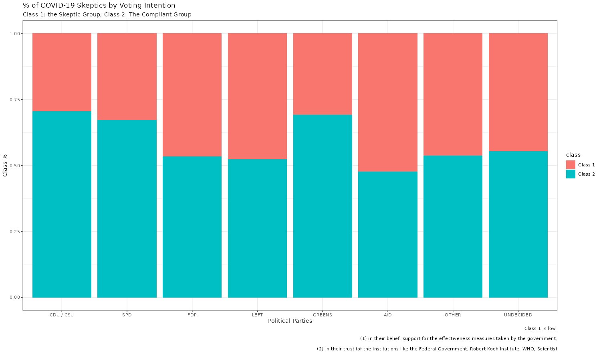

## Attitudes towards COVID-19 and Voting Intention in Germany
Using a representative sample of German voters, I uncovered two distinct groups of voter profiles utilizing COVID-19 orientations. These groups differ in their beliefs towards the effectiveness of government measures, compliance with a possible curfew, and trust in various institutions. Almost half of the people who intended to vote FDP, LINKE, or AfD are Corona-skeptics.

